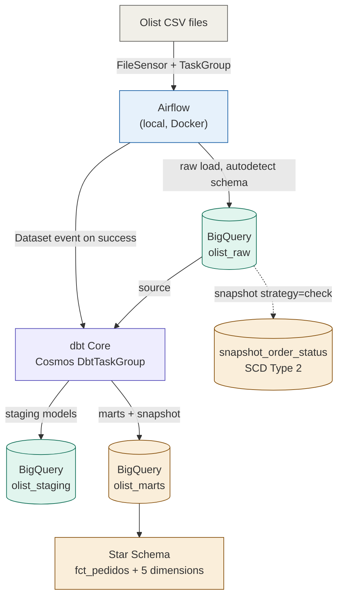
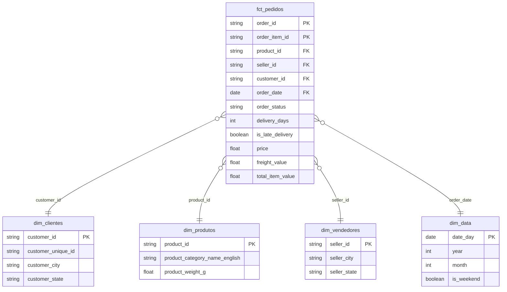

# Olist Data Pipeline — Airflow + dbt Core (Cosmos) + BigQuery

An end-to-end analytics engineering project built on the public
[Brazilian E-Commerce (Olist)](https://www.kaggle.com/datasets/olistbr/brazilian-ecommerce) dataset.
Raw CSVs are ingested with **Apache Airflow**, transformed with **dbt Core** (orchestrated
inside Airflow via **astronomer-cosmos**) into a dimensional **Star Schema** on
**Google BigQuery**, with automated testing and change-history tracking (SCD Type 2)
built in.

> **Note:** this project originally ran transformations through **dbt Cloud**, triggered
> via `DbtCloudRunJobOperator`. It was migrated to dbt Core + Cosmos after the dbt Cloud
> free trial ended — the Developer (free) tier has no access to the dbt Cloud APIs
> (Administrative/Discovery are Starter/Enterprise/Enterprise+ only), so the API-based
> trigger stopped working. This is a study project, not a production one, so the fix was
> to remove the paid-tier dependency rather than pay for it — with the side benefit that
> each dbt model, test, and snapshot now shows up as its own task in the Airflow graph
> instead of one opaque "run dbt Cloud job" box.

This project follows an **ELT** approach: data is loaded raw first, then transformed
declaratively in SQL — not cleaned in Python before landing in the warehouse.

## Architecture



Airflow owns **orchestration** (when things run, retries, dependencies) and, via Cosmos,
runs dbt Core directly in the worker — each model, test and snapshot becomes its own
task in the DAG graph, giving per-model lineage and retries without a separate managed
transformation platform. Neither DAG needs a manual trigger: `olist_raw_ingestion` runs
on a daily schedule, and `olist_dbt_transformation` is scheduled on an Airflow
**Dataset** that fires automatically as soon as `olist_raw_ingestion` finishes loading
the raw tables — no cross-DAG polling needed either.

## Star schema



**Grain**: one row per order item (not per order). This is the most atomic grain the
source data supports — it can always be aggregated up to order-level later, but never
disaggregated back down if loaded pre-summed. Payment data is intentionally **not**
joined into `fct_pedidos`: `order_payments` is recorded at order grain, and joining it
into an item-grain fact would double-count payment values on multi-item orders (a
classic dimensional modeling "fan-out" bug). It lives instead in its own fact table,
`fct_pagamentos` (grain: order + payment_sequential, since a single order can be split
across more than one payment method).

## Tech stack

| Layer | Tool |
|---|---|
| Orchestration | Apache Airflow 2.9 (Docker, LocalExecutor) |
| Transformation | dbt Core, orchestrated via astronomer-cosmos |
| Warehouse | Google BigQuery |
| Language | Python 3.11, SQL |
| Data quality | dbt generic + custom tests, `dbt_utils` |
| Change tracking | dbt snapshot (SCD Type 2) |
| Version control | Git / GitHub |

## Repository structure

```
olist-data-pipeline/
├── .github/workflows/
│   └── ci.yml                      # pytest + dbt parse on every push/PR
├── dags/                          # Airflow DAGs
│   ├── olist_raw_ingestion_dag.py       # CSV -> BigQuery raw (sensor, retries, TaskGroup)
│   └── olist_dbt_transformation_dag.py  # Runs dbt Core via Cosmos, Dataset-triggered
├── dbt/
│   ├── models/
│   │   ├── staging/                # 1:1 cleanup layer (rename, type casts, dedupe)
│   │   │   └── sources.yml               # source freshness config
│   │   └── marts/                  # Star schema: 2 facts + dimensions
│   ├── snapshots/                  # SCD Type 2 history tracking
│   ├── tests/                      # Custom singular tests
│   └── dbt_project.yml
├── scripts/
│   └── gcp_bigquery_utils.py       # Raw CSV -> BigQuery load helper
├── tests/                          # pytest: load helper (mocked) + DAG import test
├── data/raw/                       # Olist CSVs (not versioned)
├── keys/                           # GCP service account (not versioned)
├── docker-compose.yml
├── profiles.yml.example            # dbt profile template (copy to profiles.yml)
├── requirements-dev.txt            # deps to run tests/ locally
└── .env.example
```

## Pipeline stages

### 1. Raw ingestion (Airflow)
`olist_raw_ingestion` DAG waits for the 9 source CSVs via `FileSensor`, then loads each
into BigQuery (`olist_raw` dataset) with dynamic task mapping — one task per file,
grouped in a `TaskGroup`. No transformation happens here; schema is auto-detected and
data lands as-is. Retries (3x, 2min backoff) and per-task `execution_timeout` handle
transient failures.

One real-world data quality issue surfaced and handled here: `order_reviews.csv`
contains free-text customer comments with unescaped quote characters, which broke
BigQuery's default CSV parser (`Missing close quote character`). Fixed via
`allow_quoted_newlines=True` and a bounded `max_bad_records` tolerance, with malformed
rows logged rather than silently dropped.

After each table loads, the loader stamps a `_loaded_at` column (`CURRENT_TIMESTAMP()`)
on it. The Olist CSVs only carry business timestamps (`order_purchase_timestamp` etc.),
none of which say *when the raw table itself was loaded* — `_loaded_at` is what
`dbt source freshness` checks against (see Testing & CI below).

### 2. Staging (dbt)
One model per raw table: column renaming, type casting, and light derived fields
(e.g. `delivery_days`, `is_late_delivery` in `stg_orders`). Also fixes a schema
autodetection failure on `product_category_translation` (BigQuery loaded it with
generic `string_field_0/1` column names since the source CSV has only two columns) —
corrected at this layer rather than by re-running ingestion, since staging's job is
exactly to absorb inconsistencies from raw.

### 3. Marts (dbt)
`fct_pedidos` (item grain) plus five dimensions (`dim_clientes`, `dim_produtos`,
`dim_vendedores`, `dim_data`, `dim_geolocalizacao`), and `fct_pagamentos` (order +
payment grain) as its own fact table, kept separate precisely to avoid the fan-out
described above. `dim_geolocalizacao` aggregates the raw geolocation table (which has
many lat/lng rows per zip code) down to one row per zip code — otherwise joining it
into the fact would multiply row counts.

### 4. Change tracking (dbt snapshot)
`snapshot_order_status` tracks `order_status` and `order_delivered_customer_date`
changes over time using the `check` strategy (the source has no reliable "last updated"
timestamp, so column-value comparison across runs is used instead of a timestamp
strategy). Note: since the Olist dataset is static, history only accumulates across
multiple pipeline runs where the underlying source actually changes — this is expected
behavior, not a bug.

### 5. Testing (dbt)
Generic tests (`not_null`, `unique`, `relationships`, `dbt_utils.accepted_range`,
`dbt_utils.unique_combination_of_columns`) on keys and foreign keys across the star
schema (both `fct_pedidos` and `fct_pagamentos`), plus one custom singular test
(`assert_positive_delivery_days`) asserting no order has a negative delivery time —
a business rule generic tests can't express.

### 6. Orchestrated transformation (Airflow → dbt Core via Cosmos)
`olist_dbt_transformation` DAG uses `astronomer-cosmos`' `DbtTaskGroup` to parse the dbt
project and render one Airflow task per model/test/snapshot (run + test in dependency
order), executing dbt Core directly in the Airflow worker. The DAG is scheduled on an
Airflow `Dataset` emitted by `olist_raw_ingestion` on success, so it triggers
automatically instead of needing a manual run or a separate cross-DAG sensor.

## Testing & CI

Two layers of testing outside dbt's own generic/singular tests:

- **`tests/` (pytest)** — unit tests for `scripts/gcp_bigquery_utils.py` (the BigQuery
  client is mocked; no network calls, no credentials needed) covering the happy path,
  the missing-file error, the malformed-rows warning, and the `_loaded_at` stamp; plus
  a standard Airflow **DagBag import test** (`tests/test_dagbag.py`) that fails the
  build if a DAG has a syntax error, a broken import, a dependency cycle, or is missing
  — the most common way a DAG silently breaks. Run locally with:
  ```
  pip install -r requirements-dev.txt
  pytest tests/ -v
  ```
- **`.github/workflows/ci.yml`** — runs on every push/PR to `main`: the pytest suite
  above, plus a `dbt deps && dbt parse` step against a dummy BigQuery profile (no real
  GCP credentials touch this repo) to catch broken `ref()`/`source()` calls and invalid
  YAML/Jinja before merge. It does **not** run `dbt source freshness` or a full
  `dbt build` in CI, since those need a real warehouse connection — running those
  against a real project would mean adding GCP service-account secrets to GitHub, which
  is a deliberate call to leave manual for this study repo rather than wire up
  automatically.
- **`dbt source freshness`** (run manually, from inside `dbt/`) checks `_loaded_at` on
  every raw table against the thresholds in `models/staging/sources.yml`
  (`warn_after: 24h`, `error_after: 72h` — adjust to taste).

## Setup

**Prerequisites**: Docker Desktop, a GCP project with BigQuery enabled and billing
configured. No dbt Cloud account needed — transformations run as dbt Core inside
Airflow.

1. Clone the repo and `cd` into it.
2. `cp .env.example .env` and fill in your GCP project ID.
3. Create a GCP service account with `BigQuery Data Editor` + `BigQuery Job User`,
   download its JSON key to `keys/gcp-key.json`.
4. `cp profiles.yml.example profiles.yml` and fill in your GCP project ID and a dev
   dataset name (e.g. your username) — this is the dbt profile Cosmos uses to run
   models against BigQuery.
5. Download the [Olist dataset](https://www.kaggle.com/datasets/olistbr/brazilian-ecommerce)
   from Kaggle and place the CSVs in `data/raw/`.
6. `docker compose up airflow-init` (first time only), then `docker compose up -d`.
7. Open the Airflow UI at `localhost:8080` and unpause both DAGs. `olist_raw_ingestion`
   runs on its own daily schedule from there — or trigger it manually for an immediate
   first run. Either way, once it succeeds, `olist_dbt_transformation` fires
   automatically (Dataset-triggered) and runs staging + marts + tests + snapshot.

## Roadmap

- [x] Environment setup (Docker Compose + Airflow)
- [x] Raw ingestion (Airflow → BigQuery)
- [x] Staging layer (9 models)
- [x] Marts / Star Schema (2 facts + 5 dimensions)
- [x] Airflow maturity (sensor, retries, TaskGroup)
- [x] SCD Type 2 snapshot
- [x] Automated testing (dbt generic + custom, pytest, DagBag import test)
- [x] CI (GitHub Actions: pytest + dbt parse on every push/PR)
- [x] Documentation
- [x] dbt Core + Cosmos transformation, Dataset-triggered from ingestion
- [x] `fct_pagamentos` fact table (order + payment grain, no fan-out)
- [x] Source freshness checks (`dbt source freshness` on `_loaded_at`)
- [x] Both DAGs run on a recurring schedule — no manual trigger required
      (`olist_raw_ingestion`: `@daily`; `olist_dbt_transformation`: Dataset-triggered)

