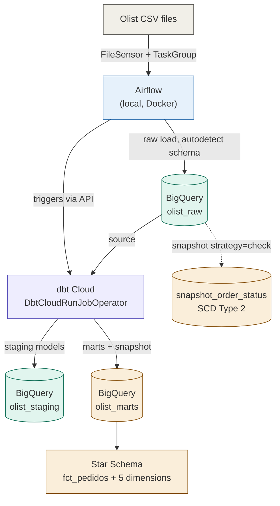
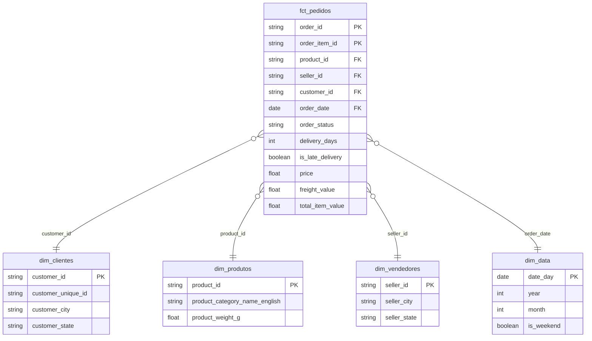

# Olist Data Pipeline — Airflow + dbt Cloud + BigQuery

An end-to-end analytics engineering project built on the public
[Brazilian E-Commerce (Olist)](https://www.kaggle.com/datasets/olistbr/brazilian-ecommerce) dataset.
Raw CSVs are ingested with **Apache Airflow**, transformed with **dbt Cloud** into a
dimensional **Star Schema** on **Google BigQuery**, with automated testing and
change-history tracking (SCD Type 2) built in.

This project follows an **ELT** approach: data is loaded raw first, then transformed
declaratively in SQL — not cleaned in Python before landing in the warehouse.

## Architecture



Airflow owns **orchestration** (when things run, retries, dependencies). dbt Cloud owns
**transformation** (the actual SQL logic, testing, documentation). This separation mirrors
how these tools are used in production data teams: Airflow rarely runs `dbt run` locally
in a worker — it delegates to a managed transformation platform via API.

## Star schema



**Grain**: one row per order item (not per order). This is the most atomic grain the
source data supports — it can always be aggregated up to order-level later, but never
disaggregated back down if loaded pre-summed. Payment data is intentionally **not**
joined into the fact table: `order_payments` is recorded at order grain, and joining it
into an item-grain fact would double-count payment values on multi-item orders (a
classic dimensional modeling "fan-out" bug).

## Tech stack

| Layer | Tool |
|---|---|
| Orchestration | Apache Airflow 2.9 (Docker, LocalExecutor) |
| Transformation | dbt Cloud (dbt Fusion engine) |
| Warehouse | Google BigQuery |
| Language | Python 3.11, SQL |
| Data quality | dbt generic + custom tests, `dbt_utils` |
| Change tracking | dbt snapshot (SCD Type 2) |
| Version control | Git / GitHub, CI via dbt Cloud PR flow |

## Repository structure

```
olist-data-pipeline/
├── dags/                          # Airflow DAGs
│   ├── olist_raw_ingestion_dag.py       # CSV -> BigQuery raw (sensor, retries, TaskGroup)
│   └── olist_dbt_transformation_dag.py  # Triggers dbt Cloud job via API
├── dbt/
│   ├── models/
│   │   ├── staging/                # 1:1 cleanup layer (rename, type casts, dedupe)
│   │   └── marts/                  # Star schema: fact + dimensions
│   ├── snapshots/                  # SCD Type 2 history tracking
│   ├── tests/                      # Custom singular tests
│   └── dbt_project.yml
├── scripts/
│   └── gcp_bigquery_utils.py       # Raw CSV -> BigQuery load helper
├── data/raw/                       # Olist CSVs (not versioned)
├── keys/                           # GCP service account (not versioned)
├── docker-compose.yml
└── .env.example
```

## Pipeline stages

### 1. Raw ingestion (Airflow)
`olist_raw_ingestion` DAG waits for the 9 source CSVs via `FileSensor`, then loads each
into BigQuery (`olist_raw` dataset) with dynamic task mapping — one task per file,
grouped in a `TaskGroup`. No transformation happens here; schema is auto-detected and
data lands as-is. Retries (3x, 2min backoff) and per-task `execution_timeout` handle
transient failures.

One real-world data quality issue surfaced and handled here: `order_reviews.csv`
contains free-text customer comments with unescaped quote characters, which broke
BigQuery's default CSV parser (`Missing close quote character`). Fixed via
`allow_quoted_newlines=True` and a bounded `max_bad_records` tolerance, with malformed
rows logged rather than silently dropped.

### 2. Staging (dbt)
One model per raw table: column renaming, type casting, and light derived fields
(e.g. `delivery_days`, `is_late_delivery` in `stg_orders`). Also fixes a schema
autodetection failure on `product_category_translation` (BigQuery loaded it with
generic `string_field_0/1` column names since the source CSV has only two columns) —
corrected at this layer rather than by re-running ingestion, since staging's job is
exactly to absorb inconsistencies from raw.

### 3. Marts (dbt)
`fct_pedidos` plus five dimensions (`dim_clientes`, `dim_produtos`, `dim_vendedores`,
`dim_data`, `dim_geolocalizacao`). `dim_geolocalizacao` aggregates the raw geolocation
table (which has many lat/lng rows per zip code) down to one row per zip code —
otherwise joining it into the fact would multiply row counts.

### 4. Change tracking (dbt snapshot)
`snapshot_order_status` tracks `order_status` and `order_delivered_customer_date`
changes over time using the `check` strategy (the source has no reliable "last updated"
timestamp, so column-value comparison across runs is used instead of a timestamp
strategy). Note: since the Olist dataset is static, history only accumulates across
multiple pipeline runs where the underlying source actually changes — this is expected
behavior, not a bug.

### 5. Testing (dbt)
Generic tests (`not_null`, `unique`, `relationships`, `dbt_utils.accepted_range`) on
keys and foreign keys across the star schema, plus one custom singular test
(`assert_positive_delivery_days`) asserting no order has a negative delivery time —
a business rule generic tests can't express.

### 6. Orchestrated transformation trigger (Airflow → dbt Cloud)
`olist_dbt_transformation` DAG calls `DbtCloudRunJobOperator`, which triggers a `dbt
build` job (run + test in dependency order) in dbt Cloud via its REST API and polls
until completion. This keeps orchestration (Airflow) and transformation execution
(dbt Cloud) as separate, independently scalable concerns.

## Setup

**Prerequisites**: Docker Desktop, a GCP project with BigQuery enabled and billing
configured, a dbt Cloud account (free Developer tier works).

1. Clone the repo and `cd` into it.
2. `cp .env.example .env` and fill in your GCP project ID.
3. Create a GCP service account with `BigQuery Data Editor` + `BigQuery Job User`,
   download its JSON key to `keys/gcp-key.json`.
4. Download the [Olist dataset](https://www.kaggle.com/datasets/olistbr/brazilian-ecommerce)
   from Kaggle and place the CSVs in `data/raw/`.
5. `docker compose up airflow-init` (first time only), then `docker compose up -d`.
6. Open the Airflow UI at `localhost:8080`, trigger `olist_raw_ingestion`.
7. In dbt Cloud, connect this repo, set the project subdirectory to `dbt`, connect the
   same BigQuery project, and create a deployment job running `dbt build`.
8. Add an Airflow connection (`dbt_cloud_default`, type `dbt Cloud`) with your dbt Cloud
   account ID, API service token, and tenant domain.
9. Trigger `olist_dbt_transformation` to run staging + marts + tests + snapshot.

## Roadmap

- [x] Environment setup (Docker Compose + Airflow)
- [x] Raw ingestion (Airflow → BigQuery)
- [x] Staging layer (9 models)
- [x] Marts / Star Schema (fact + 5 dimensions)
- [x] Airflow maturity (sensor, retries, TaskGroup, dbt Cloud API integration)
- [x] SCD Type 2 snapshot
- [x] Automated testing (generic + custom)
- [x] Documentation

## Possible next steps

- Add a real-time trigger: run `olist_dbt_transformation` automatically on
  `olist_raw_ingestion` success (DAG dependency / TriggerDagRunOperator).
  - Add a `fct_pagamentos` fact table at order grain to safely bring payment data
  into the model without fan-out.
- Schedule both DAGs on a recurring interval instead of manual trigger.
- Add data freshness checks (`dbt source freshness`).

---

*Personal project for Data Engineering practice — Airflow, dbt Cloud, and dimensional
modeling on GCP/BigQuery.*
